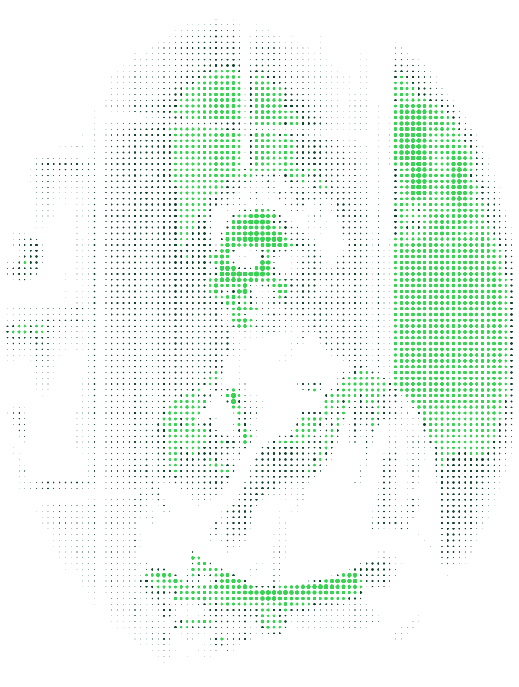
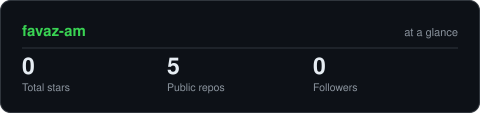
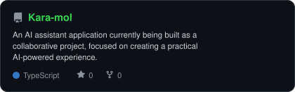
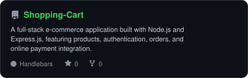
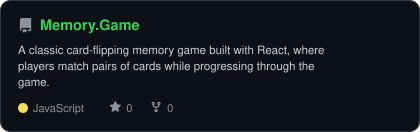
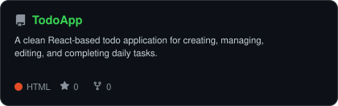

 

  

---

## ~/ whoami

Hi, I'm **Muhammed Favaz AM**, a BCA student and aspiring **MERN Stack Developer** focused on building modern, practical web applications.

I'm currently strengthening my skills in **JavaScript, React, Node.js, Express.js, MongoDB, Next.js, REST APIs, and Git/GitHub** while building real-world projects and improving my problem-solving skills.

I enjoy turning ideas into working applications and learning how different parts of the modern web stack connect together — from frontend interfaces to backend APIs and databases.

Currently, I'm working on **Kara-mol**, an AI assistant application, while continuing to expand my full-stack development skills.

> **Currently learning:** Next.js, advanced React, backend development, REST APIs, and modern full-stack practices.

 

## `~/` toolbox

---

## `~/` skill radar

<table>
<tr>
<td width="50%" align="center" valign="middle">

<!-- Self-rated radar - edit assets/skills.json, the workflow redraws it -->
<picture>
  <source media="(prefers-color-scheme: dark)"  srcset="assets/radar-dark.svg">
  <source media="(prefers-color-scheme: light)" srcset="assets/radar-light.svg">
  
</picture>

</td>
<td width="50%" align="center" valign="middle">

<!-- Live radar built from real language byte counts across your repos -->
<picture>
  <source media="(prefers-color-scheme: dark)"  srcset="assets/radar-langs-dark.svg">
  <source media="(prefers-color-scheme: light)" srcset="assets/radar-langs-light.svg">
  
</picture>

</td>
</tr>
</table>

---

## `~/` contribution calendar

<!-- 3D isometric calendar, regenerated every 6h by .github/workflows/metrics.yml -->

  

<!-- Snake eats the contribution graph - .github/workflows/snake.yml -->
<picture>
  <source media="(prefers-color-scheme: dark)"  srcset="https://raw.githubusercontent.com/favaz-am/favaz-am/output/snake-dark.svg">
  <source media="(prefers-color-scheme: light)" srcset="https://raw.githubusercontent.com/favaz-am/favaz-am/output/snake.svg">
  
</picture>

---

## `~/` the numbers

<!-- Generated by scripts/cards.py into this repo. Deliberately NOT
     github-readme-stats / streak-stats / github-profile-trophy: those are
     shared public instances that go down and take the whole section with them. -->
<picture>
  <source media="(prefers-color-scheme: dark)"  srcset="assets/card-stats-dark.svg">
  <source media="(prefers-color-scheme: light)" srcset="assets/card-stats-light.svg">
  
</picture>

 

  

---

## `~/` selected work

<!-- Cards generated by scripts/cards.py from assets/projects.json.
     Stars, forks and language are pulled live from the API on every run. -->

<table>
<tr>

<td width="50%">

  <a href="https://github.com/favaz-am/Kara-mol">
    <picture>
      <source media="(prefers-color-scheme: dark)" srcset="assets/card-Kara-mol-dark.svg">
      <source media="(prefers-color-scheme: light)" srcset="assets/card-Kara-mol-light.svg">
      
    </picture>
  </a>

</td>

<td width="50%">

  <a href="https://github.com/favaz-am/Shopping-Cart">
    <picture>
      <source media="(prefers-color-scheme: dark)" srcset="assets/card-Shopping-Cart-dark.svg">
      <source media="(prefers-color-scheme: light)" srcset="assets/card-Shopping-Cart-light.svg">
      
    </picture>
  </a>

</td>

</tr>

<tr>

<td width="50%">

  <a href="https://github.com/favaz-am/Memory.Game">
    <picture>
      <source media="(prefers-color-scheme: dark)" srcset="assets/card-Memory.Game-dark.svg">
      <source media="(prefers-color-scheme: light)" srcset="assets/card-Memory.Game-light.svg">
      
    </picture>
  </a>

</td>

<td width="50%">

  <a href="https://github.com/favaz-am/TodoApp">
    <picture>
      <source media="(prefers-color-scheme: dark)" srcset="assets/card-TodoApp-dark.svg">
      <source media="(prefers-color-scheme: light)" srcset="assets/card-TodoApp-light.svg">
      
    </picture>
  </a>

</td>

</tr>
</table>

| project | live | stack |
|---|---|---|
| **[Kara-mol](https://github.com/favaz-am/Kara-mol)** | — | `TypeScript` |
| **[Shopping-Cart](https://github.com/favaz-am/Shopping-Cart)** | — | `Node.js` `Express.js` `MongoDB` `Razorpay` |
| **[Memory.Game](https://github.com/favaz-am/Memory.Game)** | [Live](https://memory-game-pz3i.vercel.app/) | `React` `JavaScript` |
| **[TodoApp](https://github.com/favaz-am/TodoApp)** | [Live](https://favaz-am.github.io/TodoApp/) | `React` `JavaScript` |

---

`01110100 01101000 01100001 01101110 01101011 01110011 00100000 01100110 01101111 01110010 00100000 01110011 01100011 01110010 01101111 01101100 01101100 01101001 01101110 01100111`

